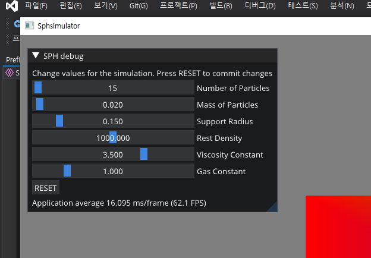
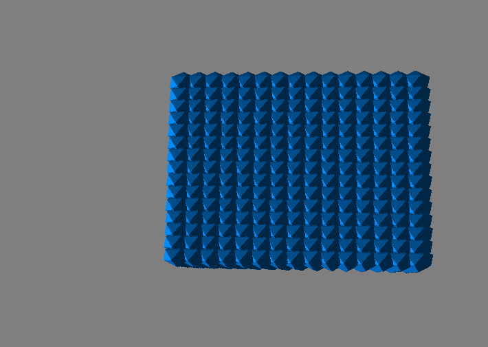
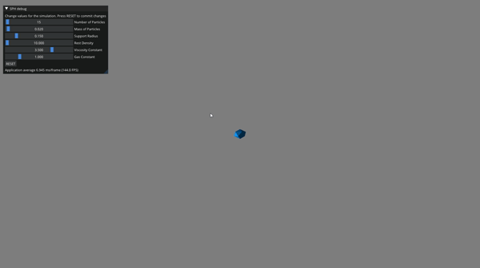
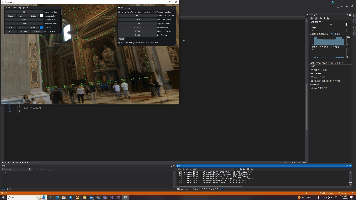
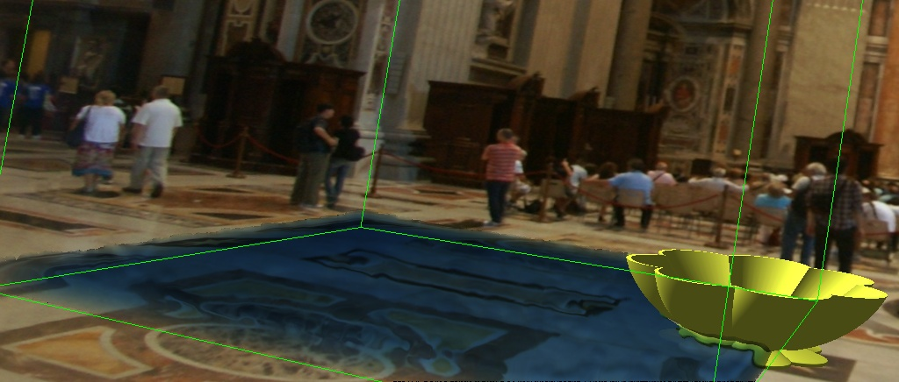
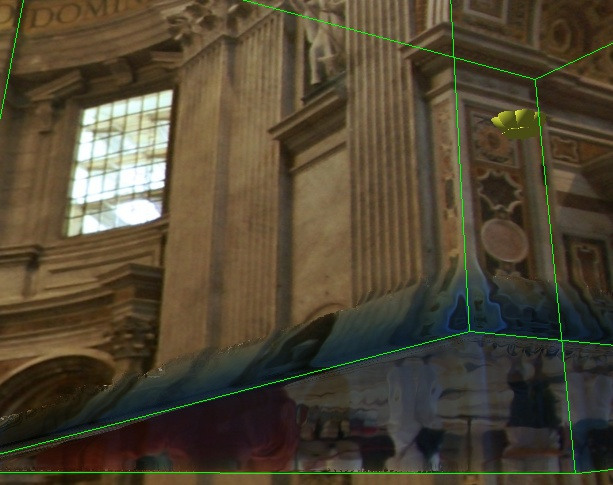
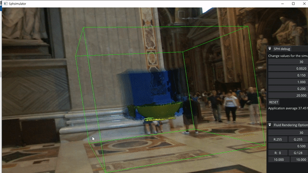
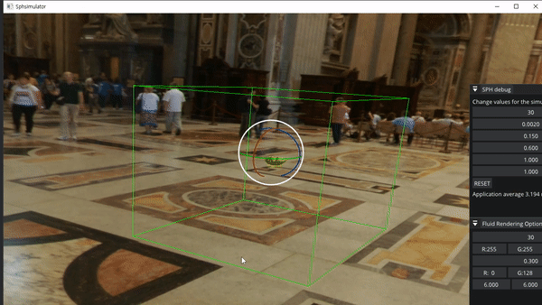
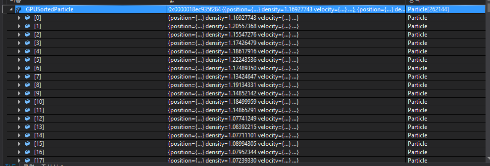
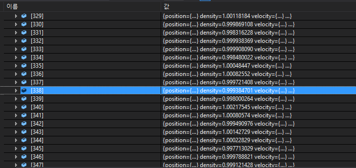

# SPHSimulator

## 주제 : SPH(smoothed particle hydrodynamics) 알고리즘을 이용한 유체 시뮬레이션

## 목적 :
### 1. GPU상에서 작동하는 SPH 알고리즘을 이용한 유체 시뮬레이션
### 2. GUI를 통해서 유체 발생 위치 및 장애물 배치 기능 구현
### 3. 투명 유체의 렌더링 파이프라인 작성

## 계획:
#### 1주차 : Directx11 + imgui를 이용한 개발환경 구성 및 SPH 개념 학습

#### 2주차 : Opengl + cpu 기반의 프로젝트( https://github.com/lijenicol/SPH-Fluid-Simulator )를 Directx + GPU기반 프로젝트로 작성

#### 3 ~ 5주차 : GUI를 이용한 유체 특성(입자 크기, 점성 등)조절 기능, 장애물 배치, 유체 생성 위치 조정 기능 구현

#### 6 ~ 8주자 : 투명 유체의 랜더링 파이프라인 작성

## 진행상황:
### 1주차
#### ~10/13 : 
* 개발환경 구성 + 및 SPH 개념 학습 

### 2주차
#### 10/16 :
* SPH에 필요한 GPU에서 작동하는 Sorting 알고리즘 구현 시작
* 
#### SPH에 Sorting을 사용하는 이유
* SPH에서 입자들을 공간을 일정크기로 나눈 격자에 배치된다고 가정하고 각 입자들은 자신이 속한 격자와 그 인접한 격자에 속한 입자들하고만 상호작용 한다고 가정
* 가령 X,Y,Z 격자에 속한 입자는 X±1,Y±1,Z±1 범위내의 격자에 속한 입자하고만 상호작용한다고 가정(그 밖의 입자와의 상호작용은 매우작아서 무시)
* 총 27개 격자의 파티클만 신경쓰면 된다.
* 입자들의 배열을 자신들의 해시값에 따라 정렬하면 같은 해시값의 입자들을 인접한 영역으로 모을 수 있음
* 이 때 특정 해시값의 입자의 인덱스가 몇번부터 몇번까지인지를 저장해두면 어느 특정 격자의 입자들의 목록을 쉽게 찾을 수 있음
* 예를들어 27이라는 해시값의 입자들의 인덱스가 1080번 부터 1089까지라고 저장해 두면 27이라는 해시값의 격자에 속한 입자와의 상호작용 계산 시 1080번부터 1089번까지의 입자만 확인하면 됨 

#### 10/17 :
* Counting sort 알고리즘 구현(파티클이 속한 셀에 있는 다른 파티클들을 찾기 위해 모든 파티클들의 배열을 해시값으로 정렬)
* 간단한 파티클의 속성을 결정하는 UI 구현(기능 미구현)

#### 10/18 : 
* 파티클을 GPU에서 해시값으로 정렬, 정렬된 해시값에서 이웃한 파티클 목록를 구하는 기능 구현

#### 10/19
* 인스턴싱을 이용한 파티클 렌더링 쉐이더 코드 작성

* 파티클을 GPU에서 업데이트 하는 코드 구현 완료

* 파티클 Sorting을 Bitonic Sort로 사용하기로 함
* Morton을 이용한 이웃 파티클 탐지 방법도 고려해보기로 함

#### 10/20
* 파티클 해시값 기반 정렬 알고리즘을 Counting sort에서 Inplace Sort가 가능한 Bitonic Sort로 변경
* 마우스 입력을 통한 카메라 줌인, 줌 아웃 및 카메라 회전 기능 구현
* 키 입력을 통한 시뮬레이션 시작 정지 기능 구현
* 적은 수의 큰 입자들을 긴 deltatime으로 시뮬레이션하면 마치 폭발하듯 튀는 것을 확인함 일단은 고정된 deltatime(0.003s)로 시뮬레이션
* Morton을 사용하는 sph 논문(https://maverick.inria.fr/~Prashant.Goswami/Research/Papers/SCA10_SPH.pdf)도 읽어봤지만 결국엔 같은 인덱스(해시값 혹은 Z-indices)를 가지는 파티클들을 배열에서 모아야 되기 때문에 똑같이 sorting을 사용하는 것으로 확인

### 3주차
#### 10/23
* 파티클 시뮬레이션에서 사용하는 커널 함수를 [https://matthias-research.github.io/pages/publications/sca03.pdf]에서 [https://cg.informatik.uni-freiburg.de/publications/2014_EG_SPH_STAR.pdf]로 변경
* 파티클의 현재 위치를 CPU로 받아와서 인스턴싱 버퍼를 만들어 렌더링 하는 방식에서 GPU에서 인스턴싱 버퍼를 수정하고 Indirect Argument로 랜더링 하는 방식으로 변경
* 현재는 파티클의 생성을 CPU에서 하고 있는데 GPU에서 하도록 변경할 예정

### 4주차
#### 10/30
sph 알고리즘 오류 수정 및 quad mesh를 이용한 sphere rendering 구현 완료

#### 10/31
유체 표면의 depth와, normal을 구하는 쉐이더 코드 작성 완료
스크린의 한 픽셀에서의 카메라 시점 기준 유체의 두께를 구하는 쉐이더 코드 작성 완료
두께를 구할 때 additive로 랜더링 하다 보니 시간이 굉장히 많이 걸리는 것으로 확인 depthstencillstate를 less, greater로 해서 최대 깊이 최소 깊이를 구한 후 (최대 - 최소)로 유체 두께를 구하는 식으로 변경할 예정

#### 11/1
그림자와 장애물이 없는 유체 렌더링 구현 완료
장애물 메시 주위에 고정된 위치의 경계 파티클을 배치하는 방식으로 장애물 구현 예정
refraction color는 굴절된 각도에 따라 큐브맵 매핑으로 만들고 있는데 장애물에 대해서는 어떻게 적용할지에 대한 학습이 필요

#### 11/2
렌더링 옵션 조정을 위한 UI추가

#### 11/3
Narrow Range Filter를 이용한 유체 표면 렌더링 개선
[https://www.semanticscholar.org/paper/A-Narrow-Range-Filter-for-Screen-Space-Fluid-Truong-Yuksel/50373abc8713985851823528e4e3ac2a494e43da]

### 5주차
#### 11/6
물에 잠긴 메시도 굴절되어 보이도록 하기 위해서
refration color 샘플링 과정을 
cubeMap.Sample(linearSampler, RefractionDir)처럼 큐브맵을 통해서 하는 방식이 아닌
absorbtionColor * backgroundTexture.Sample(linearSampler, RefractionUV)와 같이 이전에 그린 뒷 배경에서 가져오는 방식으로 변경

#### 11/7
유체의 경계면이 잘 보이도록 쉐이더 코드를 변경

#### 11/8
유체의 반사광 맵핑 공식의 잘못된 부분 변경

복셀을 기반으로 한 임의 경계 렌더링 구현함 SDF(Signed distance field)를 이용해 개선해볼 예정

### 6주차
이전에 구현한 임의 경계 방식이 경계면이 부정확한 문제가 있어
SDF를 이용해 고정된 grid 위치에 생성한 경계 파티클을 메시 쪽으로 projection을 해서 경계를 샘플링 하는 방식을 사용함
경계면에 대한 샘플링은 (Versatile Rigid-Fluid Coupling for Incompressible SPH)https://cg.informatik.uni-freiburg.de/publications/2012_SIGGRAPH_rigidFluidCoupling.pdf
를 참고함

Penetration 문제를 해결할 방법에 대한 고민이 필요 현재는 경계면에만 파티클을 배치하고 있는데 boundary mesh의 안쪽에도 파티클을 배치하여 penetration을 차단하는 방법을 시도해 볼 예정

유체의 유동이 이상하다는 피드백을 받아서
조금 더 물과 같은 표현을 위해 압력을 구할 때 사용하는 stiffness값을 키우고 점성을 줄여서 테스트를 해 봄
현재는 pressure = stiffness * ((local density / rest density)^7 - 1)와 같은 방법으로 압력을 계산함 

stiffness 10, viscosity 0.1

stiffness 1, stiffness 10, viscosity 1

stiffness를 크게 했을 때도 아래와 같이 유체가 압축되었을 때 잘 밀어내지 못하는 것으로 판단됨

유체가 압축되었을 때 잘 밀어내지 못하는 것이라면 밀도가 rest desity에서 크게 벗어나지 못하도록 제한하는 DFSPH 방법을 구현해보고자 함
[https://animation.rwth-aachen.de/media/papers/2015-SCA-DFSPH.pdf]

#### 11/17
DFSPH 구현 완료

각 업데이트 루프에서

1. 인접한 입자의 목록을 구할 수 있도록 해싱 및 정렬
2. 입자의 밀도 및 alpha 값 구하기

$$p_{i} =  \sum_{j = 0}^n {mass_{j} * W(x_i - x_j)}$$

$$a_i = p_i / ( \sum_{j = 0}^{n} (mass_j *  \bigtriangledown W(xi - xj))^2 + (\sum_{j = 0}^{n} mass_j *  \bigtriangledown W(xi - xj) )^2 )$$

3. 속도의 발산이 0이 되도록 iteration

$$\bigtriangledown  \bullet  v_i =  \sum_{j = 0}^{n} ((v_i - v_j) * w(x_i - x_k) )$$

$$ dp_i /dt = -pi  \bigtriangledown  \bullet  v_i $$

$$ k_i^v = \frac{1}{ \bigtriangleup t} \frac{dp_i}{dt} a_i $$

$$ v_i = v_i - \Delta t \sum_j m_j  (\frac{k_{i}^{v}}{p_{i}} + \frac{k_{j}^v}{p_j}) * \bigtriangledown W(xi - xj) $$

dp/dt의 평균이 일정 값 이하가 되도록 반복

4. 압력 이외의 힘 계산(점성, 중력)

5. 밀도가 restDensity에 가까워 지도록 iteration

$$ p_i^{*} =  p_i + \Delta t \sum_{j} mass_j * \bigtriangledown W(xi - xj)$$

$$ k_i^v =  \frac{p_i^{*} - p_0}{ (\Delta t)^2} a_i $$

$$ v_i = v_i - \Delta t \sum_j m_j  (\frac{k_{i}^{v}}{p_{i}} + \frac{k_{j}^v}{p_j}) * \bigtriangledown W(xi - xj) $$

6. 입자 위치 갱신

 $$ x_i(t + \Delta t) = x_i(t) $$

   

밀도가 거의 restDensity(1.00)에 가깝게 나오는 것을 확인함

### 7주차
#### 11/21

triangle mesh로부터 discrete sdf를 생성하는 알고리즘을 구현
[https://animation.rwth-aachen.de/media/papers/2015-SCA-DFSPH.pdf]

#### 11/22
sph simulation에서 임의 경계를 랜더링 하는 기법에 관한 논문을 구현 [https://animation.rwth-aachen.de/media/papers/65/2019-MIG-VolumeMaps.pdf] 

sph에서 한 입자의 밀도는 다음과 같이 정의됨

 $$ p_i = p_f(fluid tern) + p_b(Boundary term) $$

 $$ p_f =  \sum_{j = 0}^n {mass_{j} * W(x_i - x_j)} $$
 
 $$ p_b = ?? $$

  p_b를 boundary object를 particle로 샘플링 해서 p_f처럼 구할 수도 있지만

 $$ \phi (x) = SDF(X) $$

 $$ \gamma (X) = \begin{cases} \frac{C(X)}{C(0)} & 0 < x < r \ {1} & {x <= 0} \ {0} & {x >= r} \end{cases}  $$

 $$ V(x) = \int_{N(x)} {\gamma ( \phi (t)) dt} $$

 $$ p_b(x) = V(x) p_0 W(x - x^{\*}) $$ 
 x^*는 x에서 가장가까운 object위의 점

 V(X)를 미리 한번만 directe한 격자에 구해서 사용함 적분은 Gauss-Legendre 구적법을 사용함
 임의의 위치에 대해서는 trilinear sampling을 사용

 viscos force는 논문에 구체적으로 나오지는 않았지만

 $$ \frac{dv_i}{dt} = \frac{\mu *  V(x_i) * (x_i - x_i^{\*}) \bullet v_i W(x_i- x_i^{\*})}{||x_i - x_i^{\*}||^2 + 0.01supportradius^2}$$

 와 같이 사용

## 참고문헌 :

(SPH Fluids in Computer Graphics)[https://cg.informatik.uni-freiburg.de/publications/2014_EG_SPH_STAR.pdf]

(Particle-Based Fluid Simulation for Interactive Applications)[https://matthias-research.github.io/pages/publications/sca03.pdf]

(Versatile Rigid-Fluid Coupling for Incompressible SPH)https://cg.informatik.uni-freiburg.de/publications/2012_SIGGRAPH_rigidFluidCoupling.pdf
